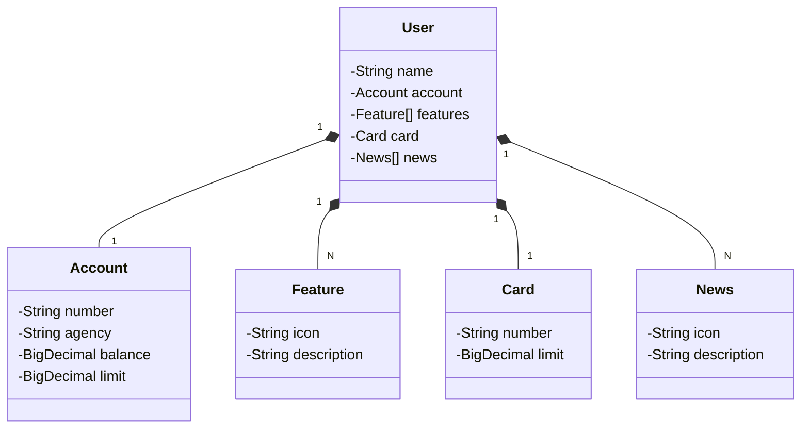

# Bootcamp Santander 2024

Java RESTful API criada para a Santander Dev Week.

## Principais Tecnologias
- **Java 17**
- **Spring Boot 3**
- **Spring Data JPA**
- **OpenAPI (Swagger)**
- **Railway**

## [Link do Figma](https://www.figma.com/file/0ZsjwjsYlYd3timxqMWlbj/SANTANDER---Projeto-Web%2FMobile?type=design&node-id=1421%3A432&mode=design&t=6dPQuerScEQH0zAn-1)

Esta imagem do Figma foi utilizada como referência para abstração deste projeto.

# Diagrama de Classes

## Documentação da API (Swagger)

### [https://bootcamp-santander-2024-production.up.railway.app/swagger-ui/index.html#/](https://bootcamp-santander-2024-production.up.railway.app/swagger-ui/index.html#/)

Obs: Está API não ficará disponível por tempo ilimitado.

